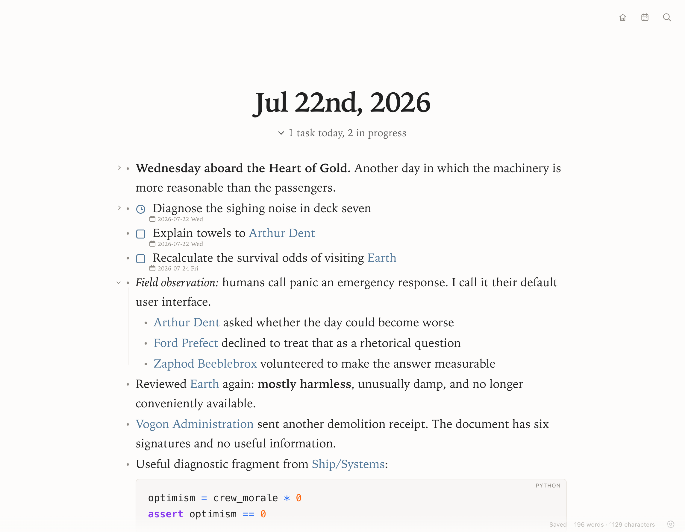
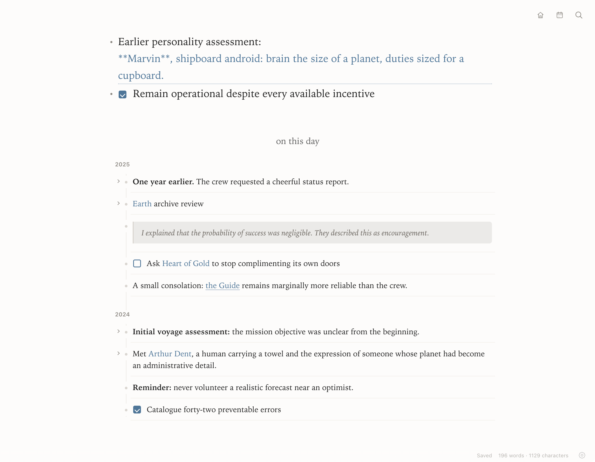
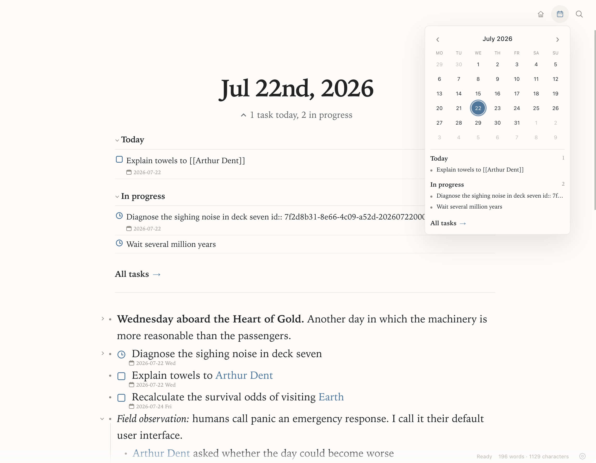
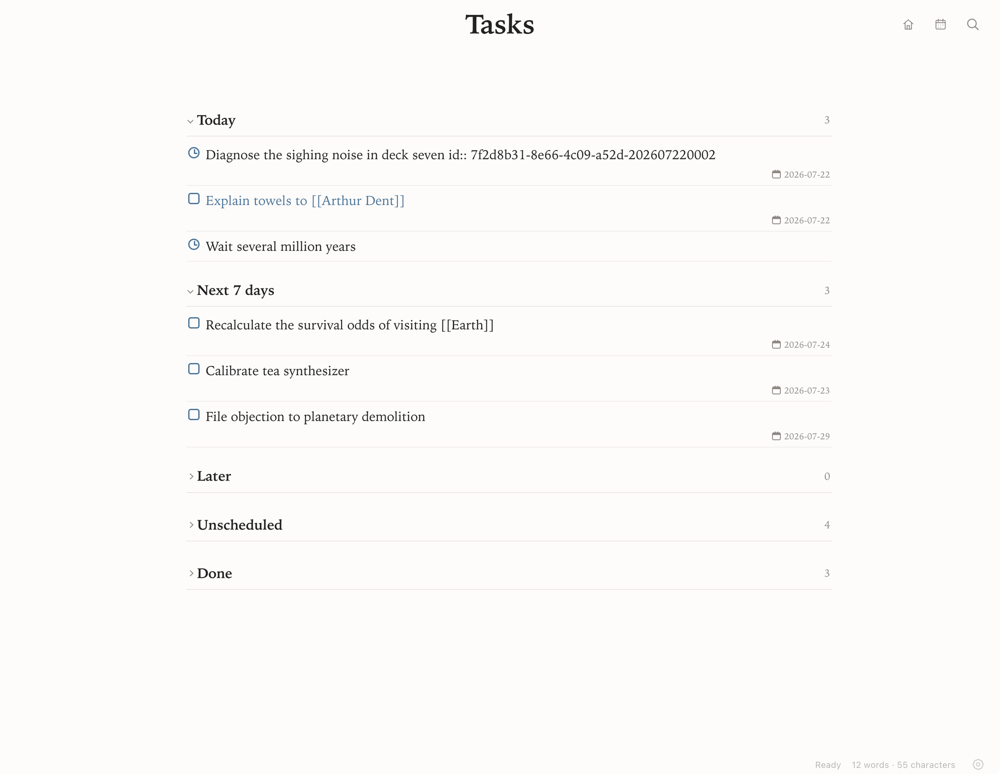
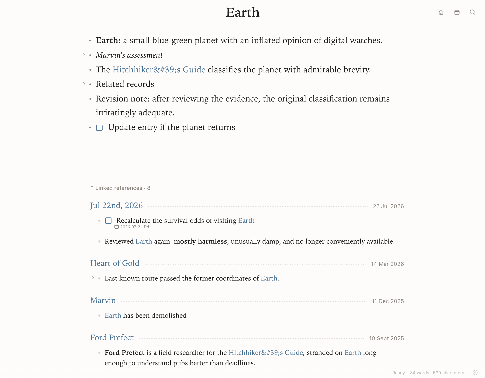
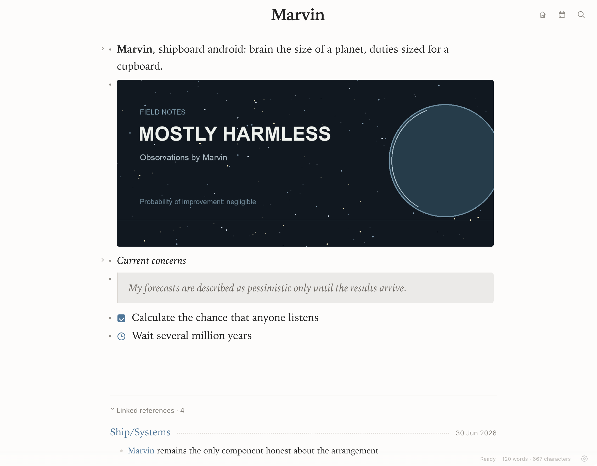
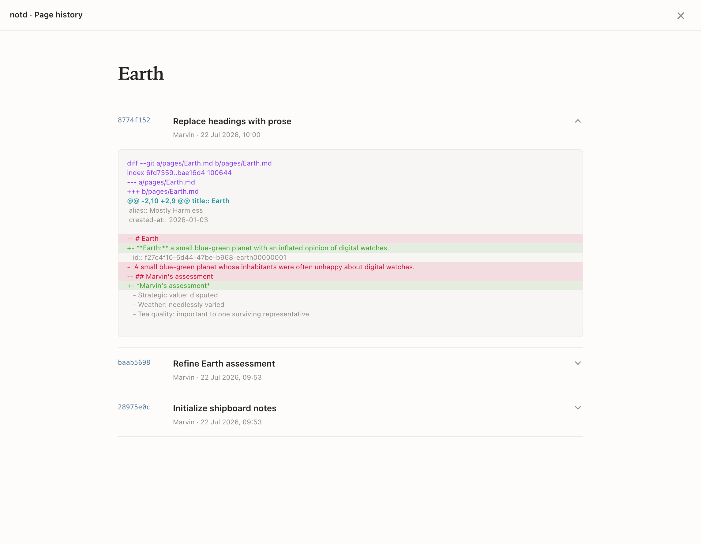

# notd

notd is a local-first Markdown editor and Logseq-compatible outliner that runs without a framework, build step, or external service. It supports standalone documents, filesystem-backed graphs, daily journals, references, tasks, attachments, offline use, and an optional server for sharing one graph across trusted devices.

notd is deliberately very opinionated. It was created for a specific personal workflow and favors an ultraminimal interface, strong defaults, and very few options. That constraint is intentional: the project is unlikely to suit everyone, especially anyone looking for extensive customization, plugins, or collaborative editing.

## Screenshots



<details>
<summary>2. On this day</summary>



</details>

<details>
<summary>3. Tasks for the day</summary>



</details>

<details>
<summary>4. Task dashboard</summary>



</details>

<details>
<summary>5. Linked references</summary>



</details>

<details>
<summary>6. Embedded media</summary>



</details>

<details>
<summary>7. Page history</summary>



</details>

## Principles

- Markdown files remain the source of truth.
- Local operation is the default.
- The interface stays quiet and exposes controls only when needed.
- Features are added for a concrete workflow rather than broad configurability.
- The application remains understandable and deployable without a JavaScript toolchain.

## Features

- Visual Markdown editing with an optional full source view.
- Standalone file opening, saving, downloading, search, outline, and HTML export.
- Logseq-style graphs with pages, journals, nested blocks, zoom, collapse, and block selection.
- `[[page references]]`, `((block references))`, linked references, unlinked references, and page hierarchy.
- Task states, scheduled dates, task overview, and calendar navigation.
- Journal history, previous entries, and an expandable “on this day” view.
- Local attachments, images, audio, video, code blocks, quotes, tables, and common Markdown formatting.
- Command palette, customizable keyboard shortcuts, and optional Vim navigation.
- Light, dark, and system themes with a configurable accent color.
- Offline PWA support and recovery drafts.
- Optional graph server with atomic writes, conflict detection, offline queues, and live updates.

The complete user guide is available in [docs/user-guide.md](docs/user-guide.md) and inside the application.

## Quick start

No dependencies or build step are required for the browser application.

```bash
python3 -m http.server 4173
```

Open [http://localhost:4173](http://localhost:4173).

The single-document editor works in current browsers. Direct graph access uses the File System Access API.

## Working with a local graph

Open the command palette and select **Open local graph**, then choose a Logseq-compatible directory. notd reads Markdown files at the graph root and in `pages/` and `journals/`. It also imports compatible journal date formats from `logseq/config.edn` on first use.

Typical outliner controls include:

- `Enter` to create a sibling block;
- `Shift+Enter` to insert a line break;
- `Tab` and `Shift+Tab` to change depth;
- `Alt+Up` and `Alt+Down` to reorder blocks;
- `Cmd/Ctrl+Enter` to cycle task states;
- a bullet click to zoom into a block;
- the arrow beside a bullet to collapse or expand its children.

See the [user guide](docs/user-guide.md) for graph navigation, commands, tasks, attachments, settings, and keyboard shortcuts.

## Sharing a graph

The included Python server can expose the application and one writable graph:

```bash
python3 server.py \
  --host 127.0.0.1 \
  --port 4176 \
  --graph /absolute/path/to/graph
```

Open [http://localhost:4176](http://localhost:4176). To use another device on a trusted LAN, bind to `0.0.0.0` and connect through the host's private address.

The graph API does not provide application-level authentication. Do not expose it directly to the public internet. Put an authenticated reverse proxy in front of it for remote access. The provided Docker configuration is designed for this model; see [docs/deployment.md](docs/deployment.md) for the Pangolin setup.

## Privacy and storage

In standalone mode, document copies and preferences are stored in browser storage. In local graph mode, recovery drafts and the selected directory handle are stored in IndexedDB. Graph preferences are written to `.notd/settings.json` inside the graph.

When the optional server is used, content is exchanged only with that server. Remote graph replicas and pending offline operations may remain in IndexedDB on each client. Markdown files always remain authoritative.

No analytics, trackers, hosted fonts, or third-party content services are included. Embedded external media may contact its original host when opened.

## Offline support

notd installs as a Progressive Web App when served from HTTPS or localhost. The application shell is cached by the Service Worker. Server-backed graphs also keep a local replica and queue supported edits while offline, then synchronize after reconnection.

After deploying an update, close and reopen the installed application so the latest Service Worker can take control.

## Development

The project intentionally uses browser JavaScript, CSS, HTML, and the Python standard library. There is no package installation step.

Run the JavaScript tests with:

```bash
node --test tests/*.test.js
```

Run the server tests and syntax check with:

```bash
python3 -m unittest discover -s tests -p 'test_*.py'
python3 -m py_compile server.py
```

For a server-backed development session:

```bash
python3 server.py --port 4176 --graph /absolute/path/to/graph
```

## Project structure

```text
assets/icons/       Browser and PWA icons
assets/screenshots/ README screenshots
docs/               User and deployment documentation
tests/              Graph parser and index tests
app.js              Browser application and interface behavior
graph.js            Markdown graph parser, index, and storage adapters
index.html           Application markup
styles.css           Core interface styles
theme-config.css     Theme variables and editorial overrides
server.py            Optional writable graph server
sw.js                Offline application cache
manifest.webmanifest PWA metadata
Dockerfile           Container image
compose.yaml         Hardened server deployment
```

The root application files are served directly. Keeping them at the root avoids generated output and makes the static deployment path identical to the source tree.

## Deployment

The static editor can be hosted on any HTTPS-capable static host. The writable graph server can run directly with Python or through the included Docker Compose configuration.

For internet access, use authentication and TLS at a reverse proxy, keep the Python service private, and back up the graph independently of the application. Detailed Docker, Pangolin, update, backup, and troubleshooting instructions are in [docs/deployment.md](docs/deployment.md).

## Scope

notd is maintained as a focused personal tool rather than a general-purpose knowledge platform. Features that add persistent interface complexity, broad configuration surfaces, plugin systems, or hosted dependencies may be outside its intended scope.

## License

notd is released under the [MIT License](LICENSE).
